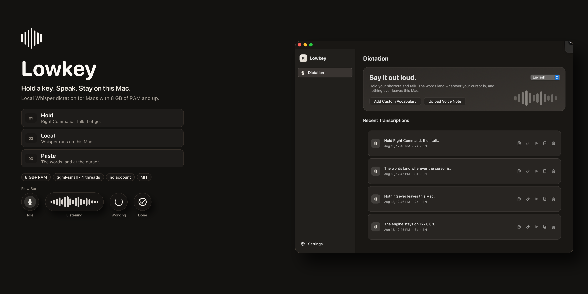
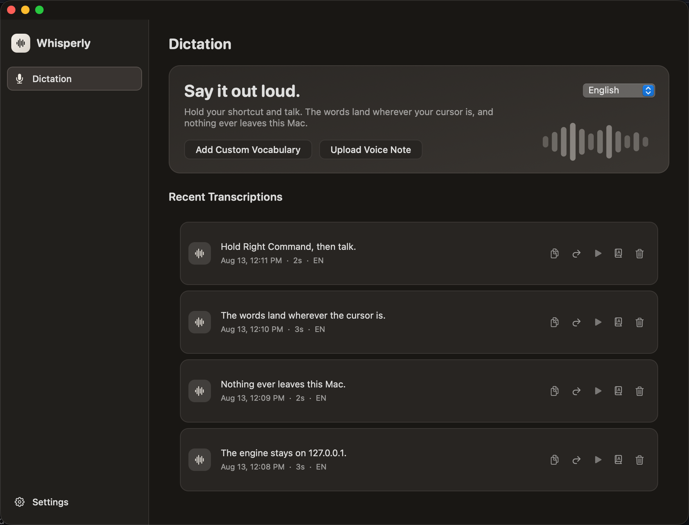
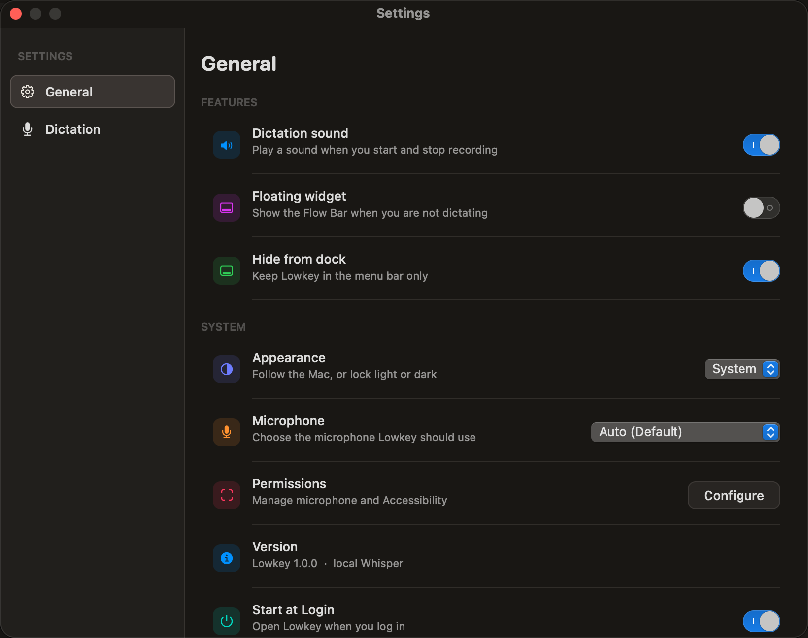
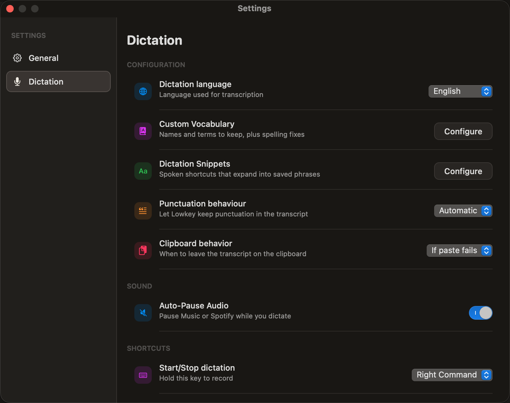

<h1 align="center">Lowkey</h1>

<p align="center">
  <a href="#quick-start"></a>
  <a href="#what-it-is"></a>
  <a href="#privacy"></a>
  <a href="LICENSE"></a>
</p>

<h3 align="center">Hold a key. Speak. Stay on this Mac.</h3>

<p align="center">
  Local Whisper dictation for machines with 8 GB of RAM and up.
  No account. No analytics. No cloud.
</p>

<p align="center">
  
</p>

## What it is

Cloud dictation wants an account, a subscription, and a machine that can host a large model. On an 8 GB Mac that is the whole computer.

Lowkey flips that.

Hold **Right Command**, talk, let go. Whisper **small** runs on the same Mac through `whisper-server` bound to `127.0.0.1`. The words land wherever the cursor is. There is no account, no analytics, and no network call except that local server.

It is built for **low-memory Macs** on purpose: a ~466 MB model, four decode threads, and no leftover decoder context from the last utterance. That is why it stays quick on 8 GB machines instead of asking you to buy more RAM.

<p align="center">
  
</p>

## Features

- **Hold to talk** - Right Command by default. Switch to Left Command, Right Option, or Fn. Press **Esc** while holding to discard the take.
- **Small on purpose** - `ggml-small.bin`, four threads, max-context 0. Light enough for an 8 GB Mac. Fast enough that short clips do not pile up.
- **Loopback only** - the engine is forced onto `127.0.0.1`. Editing `config.json` cannot point it at the network.
- **Paste, then keep the words** - sends directly to the focused WezTerm pane when WezTerm is active, or uses a keystroke paste elsewhere. If delivery cannot land, the transcript is still on the clipboard.
- **Your names, your phrases** - custom vocabulary for names and spelling, plus spoken snippets that expand into saved text.
- **History stays here** - replay, recopy, or delete. Audio and transcripts live under Application Support, not this repository.
- **Menu bar, not a dock hog** - hide from the Dock, start at login, optionally pause Music or Spotify while you talk.
- **Hardened Runtime** - local builds are signed with a self-signed `Lowkey Local` identity so Microphone and Accessibility survive rebuilds.

<p align="center">
  
  
</p>

## Quick Start

### Requirements

- macOS 14 or later
- About 8 GB of RAM or more
- [Homebrew](https://brew.sh) and the Xcode Command Line Tools

The first run downloads `ggml-small.bin` (~466 MB) and builds the app.

```bash
curl -fsSL https://raw.githubusercontent.com/nhwoodward/Lowkey/main/Scripts/install.sh | zsh
```

Or from a clone:

```bash
./Scripts/install.sh
```

Then grant **Microphone** and **Accessibility** when macOS asks. Hold **Right Command**, speak, release. Press **Esc** while holding to discard.

## How it works

```
        you hold Right Command
                  │
                  ▼
        ┌──────────────────┐
        │ Flow Bar         │  live waveform while you talk
        └────────┬─────────┘
                 ▼
        ┌──────────────────┐
        │ whisper-server   │  127.0.0.1:18789 only
        │ ggml-small.bin   │  4 threads, max-context 0
        └────────┬─────────┘
                 ▼
        words paste at the cursor
        clipboard is the failsafe
```

You talk to one shortcut. Lowkey records 16 kHz PCM on this Mac, posts it to the local engine, then delivers the transcript to the app that had focus. WezTerm receives it through its CLI; other apps receive a keystroke paste. If delivery will not land, Cmd+V still has the same text.

## Privacy

Audio and transcripts stay on the Mac.

- The engine listens only on `127.0.0.1`. There is no account, no analytics, and no outbound call for transcription.
- `~/Library/Application Support/Lowkey/` is created mode `700`. History, the model, config, and logs live there. They are not part of this repository.
- Signing keys stay in Application Support. They are gitignored.
- Hardened Runtime is on. The entitlements are microphone input and Apple Events for paste, nothing else.

## Files

- App: `~/Applications/Lowkey.app`
- Model: `~/Library/Application Support/Lowkey/models/ggml-small.bin`
- Config: `~/Library/Application Support/Lowkey/config.json`
- Logs: `~/Library/Application Support/Lowkey/logs/`

## Rebuild

```bash
./Scripts/bundle.sh
open ~/Applications/Lowkey.app
```

## Signing

Local builds use **Hardened Runtime** and a self-signed `Lowkey Local` certificate so Microphone and Accessibility stay granted across rebuilds. Signing keys stay in Application Support and are not in this repo.

**Notarization** is a separate Apple scan for giving the app to other Macs. It needs a paid Apple Developer Program membership and a Developer ID certificate:

```bash
xcrun notarytool store-credentials lowkey-notary \
  --apple-id YOUR_APPLE_ID --team-id YOUR_TEAM_ID --password APP_SPECIFIC_PASSWORD
./Scripts/bundle.sh
./Scripts/notarize.sh
```

## Credits

Speech recognition is [OpenAI Whisper](https://github.com/openai/whisper) (MIT), run on this Mac through [whisper.cpp](https://github.com/ggml-org/whisper.cpp) `whisper-server`. The model is `ggml-small.bin` from that distribution.

Lowkey is an independent Mac app. It is not affiliated with OpenAI or whisper.cpp.

## License

MIT. See [LICENSE](LICENSE).
